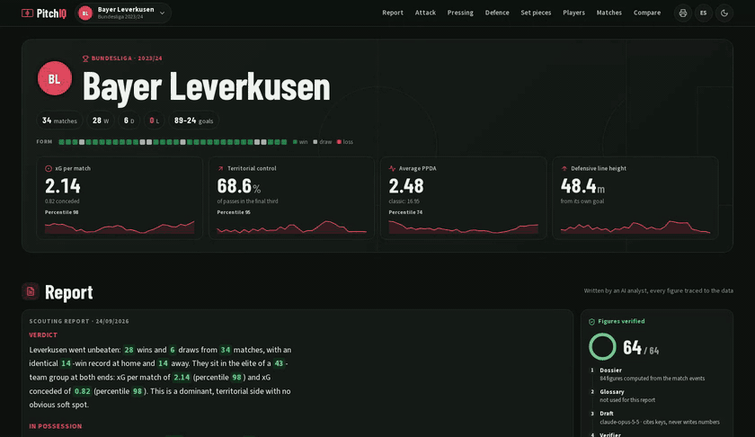
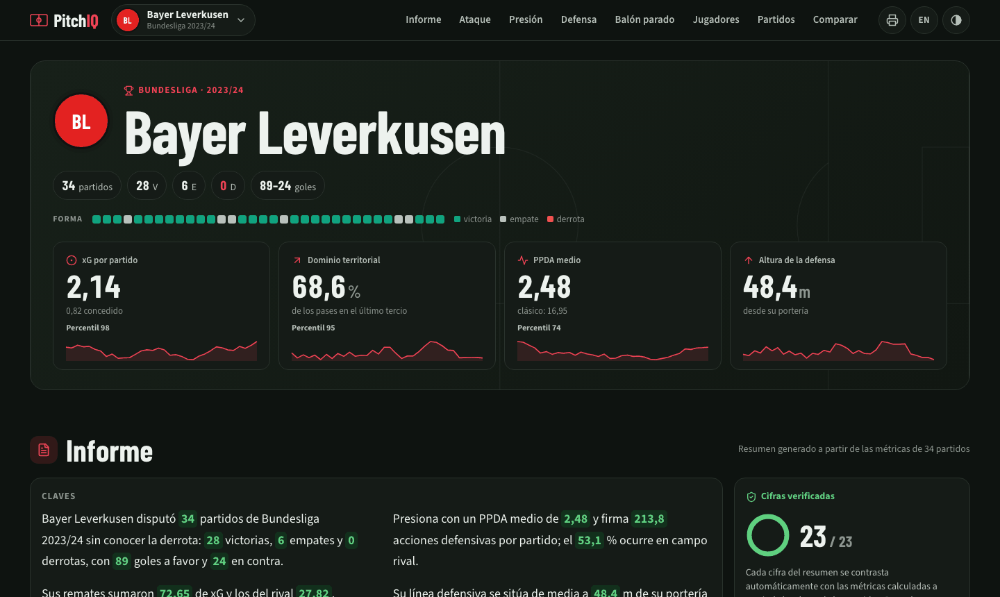
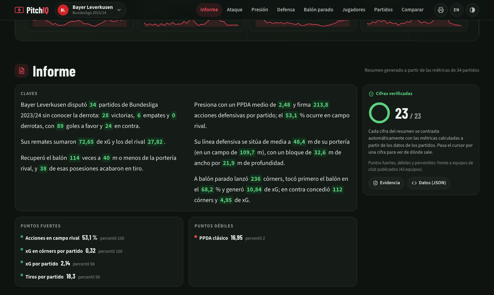
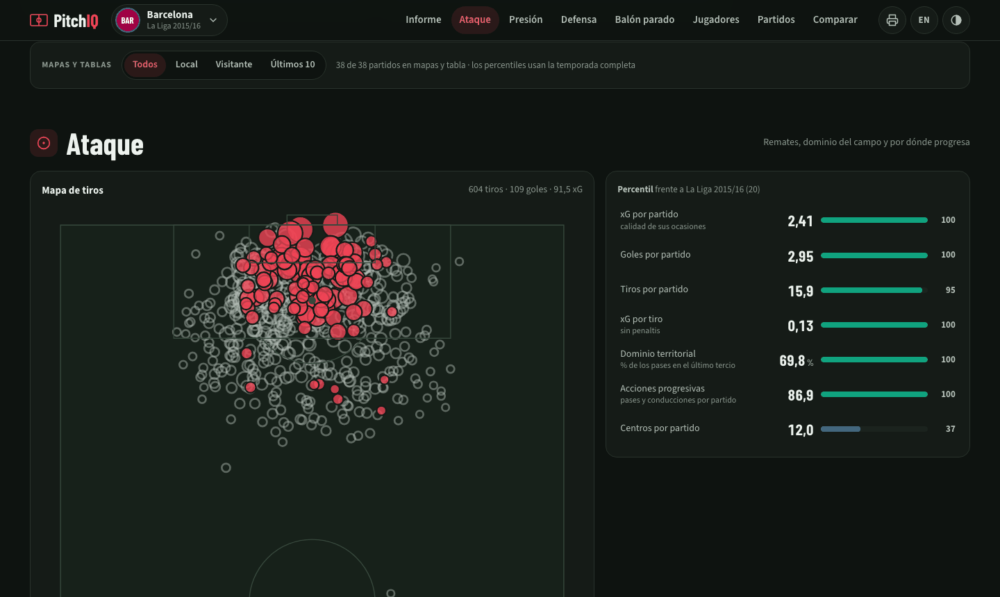
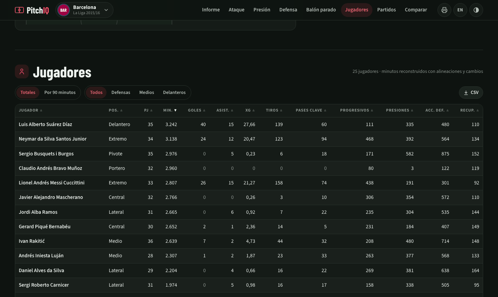
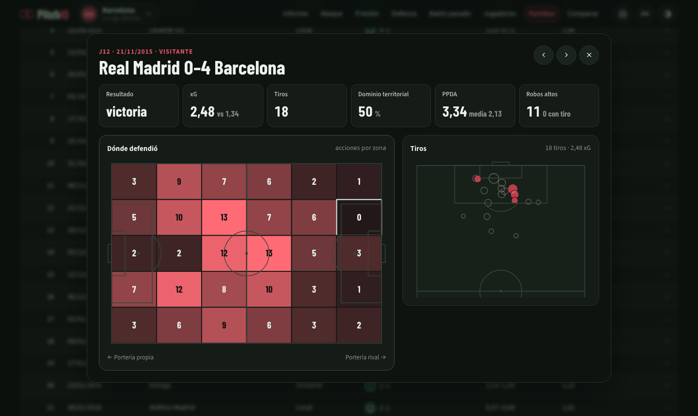
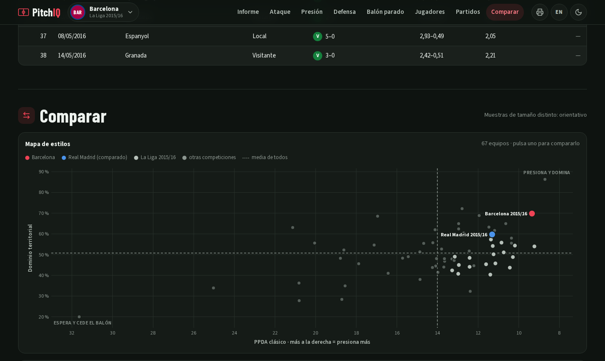

<div align="center">

# ⚽ PitchIQ

**Un analista de scouting con IA para 115 equipos de fútbol. Escribe el informe que lee un entrenador antes de un partido, y está construido para que no pueda inventarse una cifra: el modelo cita, el código pone los valores y un verificador rechaza lo demás.**

[](https://github.com/nicotimoneda/pitchiq/actions/workflows/ci.yml)


[English](README.md) · **Español**

</div>

---

<div align="center">

</div>

## Qué hace

Los modelos de lenguaje escriben bien un informe de scouting y mal sus estadísticas: sacan números que suenan bien y no lo son. PitchIQ es un agente diseñado alrededor de ese fallo.

1. **Dossier.** Python determinista convierte los eventos de StatsBomb en unos 85 datos por equipo (balance, presión, forma defensiva con datos 360, balón parado, ataque, jugadores clave) y sitúa cada uno como **percentil** frente a su liga o torneo. Cada dato tiene una clave fija, por ejemplo `{metrica.ppda}`.
2. **Redactor.** Claude escribe el informe (veredicto, con balón, sin balón, balón parado, jugadores clave y *cómo hacerle daño*) en español y en inglés. **No puede escribir un dígito**: cada cifra es una cita a una clave del dossier y el código pone el valor.
3. **Verificador.** Un nodo de LangGraph revisa cada cita. Una clave que no existe o un número escrito a mano, aunque sea correcto, devuelve el borrador al redactor con la lista exacta de fallos. Lo que sobreviva a los reintentos se enseña como sin respaldo, nunca como cierto.
4. **Contexto.** Un paso de RAG sobre un glosario táctico le explica al redactor qué *significan* las métricas. El glosario rechaza cualquier entrada con dígitos, así que la interpretación nunca cuela un número.

El resultado es un informe en el que cada cifra lleva de vuelta a los datos: al pasar el cursor se ve de qué dato sale.

## La web

La ficha de un equipo empieza con su balance, su racha y cuatro cifras clave con su percentil. Bayer Leverkusen 2023/24: 34 partidos sin perder y **2,14 xG por partido (percentil 98)**:



El informe va primero. Cada cifra resaltada es una cita que el verificador ha comprobado; el panel lateral enseña cómo se escribió (dossier → glosario → borrador → verificador) y enlaza al borrador y al dossier tal cual. Los equipos sin informe generado muestran un resumen determinista con la misma comprobación:



Ataque: mapa de tiros con tamaño según el xG y los goles encima, y cada métrica frente a la liga. Barça 2015/16: 604 tiros, 109 goles, primero de La Liga en xG por partido y en dominio territorial:



Jugadores: minutos reconstruidos con alineaciones y cambios, en totales o por 90. El Barça 2015/16 sale tal como fue (Suárez 40 goles de liga, Messi 26 y Neymar 24), directamente de los eventos:



Cada partido tiene su ficha y su enlace (`#partido-12`). Real Madrid 0–4 Barcelona, con xG, dominio, PPDA, el mapa de acciones defensivas y el de tiros:



Y un mapa de estilos con los 115 equipos (PPDA clásico frente a dominio territorial); al pulsar un punto se compara uno a uno:



También: rendimiento por campo, por mitad de temporada, según la fuerza del rival y según el marcador; filtro de partidos; exportar partidos y jugadores a CSV; exportar a PDF; español e inglés; tema claro y oscuro; escudos con los colores de cada club y banderas de las selecciones.

## Resultados

Todo lo de abajo se mide sin API key y se reproduce desde el repositorio ([evaluación completa](EVALUATION.md)).

| Comprobación | Resultado |
|---|---|
| Cifras de los informes respaldadas por los datos | **100 %**, re-verificado desde los borradores publicados con `scripts/run_eval.py` |
| Percentiles que cita el agente frente a los de la web | **2617 / 2617** idénticos (implementaciones en Python y JavaScript) |
| Goles frente a [Understat](https://understat.com), partido a partido | **1.621 de 1.621** idénticos (43 clubes) |
| xG frente a Understat, partido a partido | correlación **0,93** (modelos distintos, mismo orden de partidos) |
| PPDA clásico frente a Understat, orden de equipos | Spearman **0,93** |
| PPDA de la web (con presiones) frente a Understat | Spearman 0,74: mide volumen de presión; documentado y se enseñan los dos |
| Búsqueda en el glosario, embeddings en inglés frente a multilingües | **80 % frente a 60 %** top-1: un "arreglo" mío que empeoraba, medido y revertido |

## Puesta en marcha

Requiere [`uv`](https://github.com/astral-sh/uv).

```bash
git clone https://github.com/nicotimoneda/pitchiq.git
cd pitchiq
uv sync
uv run uvicorn app.main:app --port 8000     # → http://localhost:8000
```

Los datos calculados de los 115 equipos vienen en el repositorio: la web funciona tal cual, sin API key ni descargas.

```bash
uv run pytest                                                  # 96 tests (sin red, LLM simulado)
uv run playwright install chromium && uv run pytest -m e2e     # 14 tests en navegador
uv run python scripts/precompute.py --demo-data --jobs 6       # recalcula todos los equipos (~20 min)
uv run python scripts/precompute.py --equipos bayer-leverkusen-2023-24   # informe de ese equipo
uv run python scripts/precompute.py --solo-faltan              # todos los informes que falten (reanudable)
```

El redactor usa la API de Anthropic si hay `ANTHROPIC_API_KEY` y, si no, el CLI `claude` con tu suscripción de Claude (`claude` → `/login` una vez). El modelo por defecto es `opus`; se cambia con `PITCHIQ_MODELO`.

## Cómo funciona

| Etapa | Método | Detalle |
|---|---|---|
| Datos | StatsBomb Open Data | eventos + freeze-frames 360 con caché local; equipos elegidos en [`publicacion.yaml`](scripts/publicacion.yaml) |
| Métricas | Python determinista, todo en metros | PPDA (dos definiciones), robos altos, bloque defensivo con 360, córners, tiros y xG, dominio, acciones progresivas, jugadores, estado del marcador |
| Contexto | percentiles | frente a su liga o torneo si tiene 8 equipos o más; si no, frente a todos los clubes o selecciones publicados |
| Informe | LangGraph + Claude | dossier → glosario → redactor ⇄ verificador; el redactor cita claves, nunca escribe cifras |
| Interpretación | RAG sobre un glosario táctico | Qdrant + MiniLM; el glosario **rechaza entradas con dígitos**: los números solo salen de las herramientas |
| Servicio | FastAPI precomputada | sin API key ni librerías de ML en producción (CI revisa la imagen); datos de cada equipo bajo demanda |
| Calidad | pytest, Playwright, GitHub Actions | tests unitarios y de navegador, build de Docker y aviso semanal de temporadas nuevas |

```
datos ──▶ dossier ──▶ glosario (RAG) ──▶ redactor (LLM) ──▶ verificador ──▶ informe
          ~85 datos       significado,       cita {claves},      ¿existen todas?
          + percentiles   sin dígitos        sin dígitos         ¿cifras escritas a mano?
                                                 ▲                    │ sí
                                                 └── lista exacta de fallos (reintento)
```
Definiciones y salvedades de cada métrica: [`docs/metricas.md`](docs/metricas.md).

## Stack

Python 3.11 · uv · statsbombpy · pandas / numpy / scipy · pydantic v2 · LangGraph · Anthropic (`LLMClient` intercambiable) · Qdrant · sentence-transformers · RAGAS · FastAPI · Playwright · pytest · ruff · Docker · GitHub Actions

## Estructura del proyecto

```text
pitchiq/
├── src/pitchiq/
│   ├── data/            # cargador de StatsBomb con caché local
│   ├── metrics/         # presión, forma 360, balón parado, ataque, jugadores (funciones puras)
│   ├── agent/           # dossier, grafo LangGraph, verificador de citas, clientes LLM (API / CLI)
│   ├── rag/             # glosario táctico (sin dígitos), buscador Qdrant, evaluación RAGAS
│   └── eval/            # grounding, embeddings, generalización, contraste con Understat
├── app/                 # FastAPI + la web (una plantilla, sin build)
│   └── static/report/   # datos precalculados, informes IA por equipo, imágenes para compartir
├── scripts/
│   ├── publicacion.yaml       # qué equipos se publican
│   ├── precompute.py          # métricas (sin LLM) e informes IA (API key o CLI de Claude)
│   └── validacion_externa.py  # contraste con Understat
├── tests/               # tests unitarios + e2e/ (Playwright)
├── docs/metricas.md     # definiciones y salvedades de las métricas
├── EVALUATION.md        # qué afirma el sistema, qué no, y todas sus limitaciones
└── .github/workflows/   # CI (tests, e2e, Docker) + revisión semanal del catálogo
```

## Notas de diseño

- **El modelo cita y el código calcula.** Revisar los números a posteriori todavía deja pasar un acierto por casualidad; pedir citas elimina la casualidad. Las mismas claves alimentan el detalle de cada cifra en la web.
- **La lógica del agente vive en el grafo.** El bucle de reintentos es una arista condicional de LangGraph, así que el borrador, el veredicto y los reintentos forman parte del estado que se guarda con cada informe.
- **Todo en metros.** StatsBomb trabaja en yardas sobre un campo normalizado de 120 × 80; los valores se convierten en origen (y los umbrales se definen en metros), no se cambia solo la etiqueta.
- **Salvedades a la vista.** Los freeze-frames 360 solo muestran a los jugadores que salen en pantalla: las métricas espaciales son aproximadas y, si faltan datos, se dejan vacías en vez de estimarse. El xG es el modelo de StatsBomb y no se mezcla con el de otras fuentes.
- **Sin logos.** Los escudos oficiales son marcas registradas: los clubes llevan sus iniciales con sus colores y las selecciones su bandera.
- **Generar una vez, servir estático.** La web nunca llama a un modelo: los informes se escriben antes, se guardan con su dossier y se sirven como ficheros.

## Contacto

Nicolás Timoneda · [nicotimoneda@gmail.com](mailto:nicotimoneda@gmail.com) · [@nicotimoneda](https://github.com/nicotimoneda)

## Licencia

MIT, véase [`LICENSE`](LICENSE). Datos: [StatsBomb Open Data](https://github.com/statsbomb/open-data), usados bajo sus [condiciones](https://github.com/statsbomb/open-data/blob/master/LICENSE.pdf).
