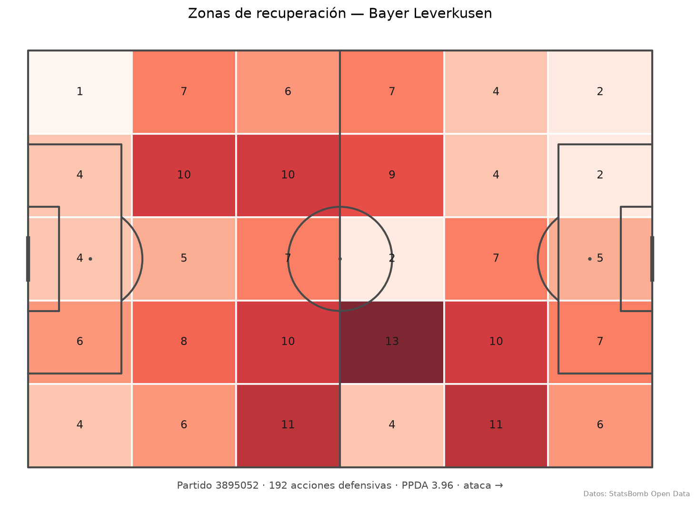

<div align="center">

# ⚽ PitchIQ

**Informes tácticos de equipo donde cada afirmación está anclada a una métrica computada — no inventada por el LLM.**

[](https://github.com/nicotimoneda/pitchiq/actions/workflows/ci.yml)


</div>

---

## Qué es

Los informes tácticos generados con LLMs tienden a afirmar cosas que los datos no sostienen. PitchIQ ataca ese problema desde la base: un pipeline que computa métricas espaciales sobre datos de eventos reales y que, en milestones posteriores, generará informes donde **cada afirmación es trazable a un número computado**. Nada de "presiona alto" sin un PPDA y un mapa de zonas detrás.

## Estado actual: M1

Proyecto en construcción. Lo que hay hoy:

- **Ingesta** de StatsBomb Open Data (partidos, eventos, freeze-frames 360) con cache local en disco.
- **Primera métrica espacial**: zonas de recuperación / acciones defensivas en rejilla 6×5 + PPDA como escalar de intensidad de presión.
- **Visualización**: heatmap de zonas sobre pista mplsoccer vía CLI.
- Tests (los de red excluidos de CI) y lint en verde.

<div align="center">

</div>

## Dataset

Sujeto de análisis: **Bayer Leverkusen, temporada del título 2023/24** (Bundesliga, `competition_id=9`, `season_id=281`). Dos caveats honestos:

- Son **los 34 partidos del Leverkusen**, no la liga entera: el sujeto es el equipo, y toda métrica se computa sobre esa muestra.
- Los datos 360 son **freeze-frames** (foto de posiciones en el instante de cada evento), no tracking continuo.

## Quick start

Requiere [`uv`](https://github.com/astral-sh/uv).

```bash
uv sync
python scripts/build_recovery_map.py --match-id 3895052 --team "Bayer Leverkusen"
# → figures/recovery_map_3895052.png + PPDA por consola
```

La primera ejecución descarga el partido de StatsBomb; las siguientes leen del cache en `data/cache/`.

## Stack

Python 3.11 · uv · statsbombpy · pandas / numpy · mplsoccer · pydantic v2 · pytest · ruff · GitHub Actions

## Roadmap

- [x] **M1** — Ingesta con cache + zonas de recuperación + PPDA + CLI de visualización
- [ ] **M2** — Métricas 360 (freeze-frames): líneas de presión, espacio a la espalda
- [ ] **M3** — Capa de agentes + RAG: informe táctico con afirmaciones ancladas a métricas
- [ ] **M4** — API FastAPI + Docker + deploy
- [ ] **M5** — Evaluación del sistema + blog post

## Créditos

Datos: [StatsBomb Open Data](https://github.com/statsbomb/open-data), usados bajo sus [términos de uso](https://github.com/statsbomb/open-data/blob/master/LICENSE.pdf). Gracias a StatsBomb por liberar datos de eventos y 360 de calidad profesional.
