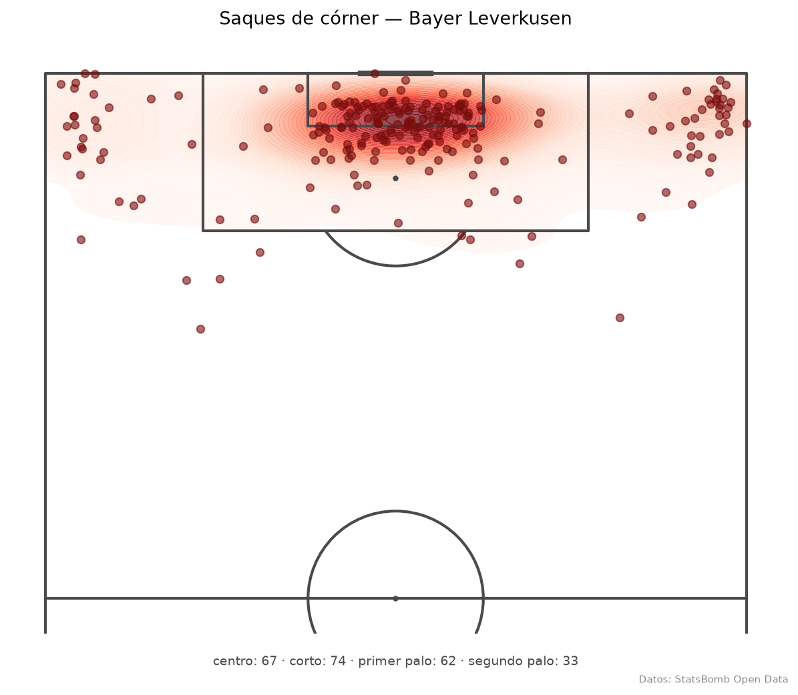
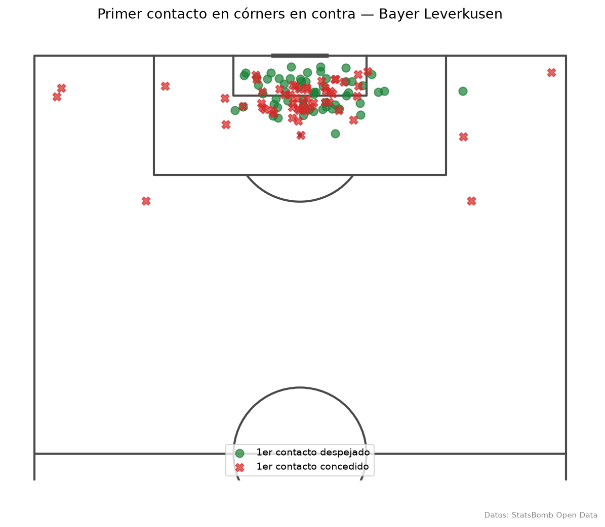
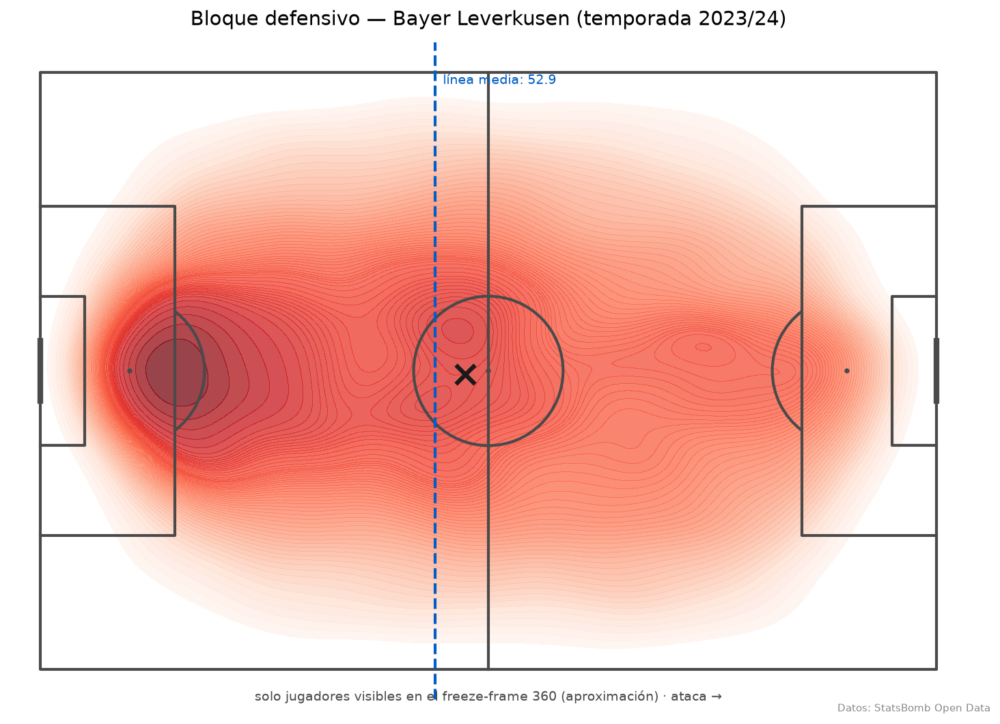
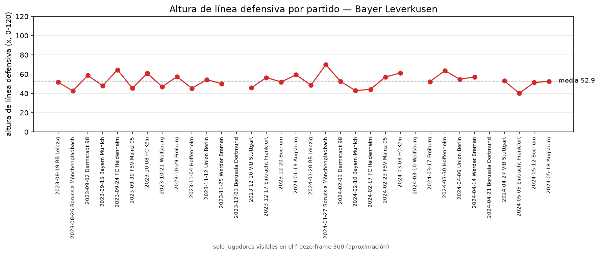

<div align="center">

# ⚽ PitchIQ

**Informes tácticos de equipo donde cada afirmación está anclada a una métrica computada — no inventada por el LLM.**

[](https://github.com/nicotimoneda/pitchiq/actions/workflows/ci.yml)


**🌐 LIVE URL: \<pendiente de deploy\>**

</div>

---

## Qué es

Los informes tácticos generados con LLMs tienden a afirmar cosas que los datos no sostienen. PitchIQ ataca ese problema desde la base: un pipeline que computa métricas espaciales sobre datos de eventos reales y que, en milestones posteriores, generará informes donde **cada afirmación es trazable a un número computado**. Nada de "presiona alto" sin un PPDA y un mapa de zonas detrás.

## La feature central: informes 100 % grounded (M4)

El LLM **no calcula ni inventa números**. Su único papel es redactar sobre las salidas de herramientas deterministas (las métricas de M1–M3, envueltas con esquemas pydantic), y un **validador automático post-generación** extrae cada cifra del texto y la coteja contra las salidas reales:

```
equipo ──▶ [nodo de herramientas]──▶ [nodo de redacción (LLM)] ──▶ validador de grounding
              deterministas              solo redacta                cifra a cifra
                                                                        │
                                              ¿cifra sin respaldo? ──▶ 1 reintento con feedback
                                                                        │ si persiste
                                                                   se marca en el informe
```

- El check es **automático y con test**: un informe con una cifra inventada baja el ratio de grounding, dispara una regeneración y, si persiste, la cifra queda marcada como no verificada en el propio informe. Nunca se publica como cierta.
- El proveedor de LLM es **intercambiable**: una interfaz fina `LLMClient` con implementación por defecto para Anthropic (`claude-opus-4-8`). Cambiar de proveedor = implementar un método.
- La evidencia completa (salidas de herramientas + reporte de grounding cifra a cifra) se guarda como `.json` junto al informe `.md`.

```bash
export ANTHROPIC_API_KEY=sk-ant-...   # solo para generar informes; nunca va al código ni al repo
python scripts/generate_report.py --team "Bayer Leverkusen"
# → reports/informe_*.md + reports/informe_*.json + ratio de grounding por consola
```

Los tests mockean el `LLMClient`: ni CI ni la suite tocan la red o el LLM real.

### RAG interpretativo (M5): contexto, nunca cifras

Sobre el pipeline anterior, una capa RAG (Qdrant local + embeddings `sentence-transformers`, todo sin API key) recupera conceptos de un **glosario táctico** y se los pasa al redactor como contexto interpretativo: qué significa en fútbol un PPDA bajo, un bloque compacto o un MOI corto. Tres garantías:

1. **El RAG no aporta números.** El glosario tiene un validador que **rechaza cualquier entrada con dígitos**; las cifras siguen saliendo solo de las herramientas y el validador de grounding de M4 se aplica sin cambios sobre el informe final. Hay un test explícito de que el contexto RAG no rompe el grounding.
2. **⚠️ El glosario está EN REVISIÓN.** Lo redactó una IA como borrador: todas las entradas llevan `revisado: false` y sus interpretaciones **no son autoritativas hasta revisión humana**. Ninguna entrada cita fuentes que no se puedan garantizar (campo `fuente: pendiente de revisión humana`). El propio informe arrastra esta advertencia.
3. **Evaluación medible.** `scripts/eval_rag.py` evalúa fidelidad y relevancia de contexto con RAGAS sobre un set de preguntas de interpretación. Usa un LLM juez de Anthropic → **cuesta llamadas de API y queda fuera de CI**. Corre en un entorno aislado (ragas es incompatible con langchain 1.x):

```bash
uv run python scripts/build_index.py                            # índice vectorial local
ANTHROPIC_API_KEY=sk-ant-... uv run --script scripts/eval_rag.py  # evaluación RAGAS
```

### Arquitectura precomputada (M6): generar una vez, servir estático

La web pública **no genera nada**: separa la GENERACIÓN (cara, con LLM, en local) del SERVIDO (barato, estático, en producción).

```
LOCAL (humano, con key)                      PRODUCCIÓN (Render, sin key)
─────────────────────────                    ────────────────────────────
scripts/precompute.py                        app FastAPI mínima
  ├─ métricas M1-M3 → figuras                  ├─ GET /            informe HTML
  ├─ informe M4+M5 (única llamada LLM)         ├─ GET /api/report   JSON
  └─ artefactos → app/static/report/           ├─ GET /api/evidence JSON
        │                                      └─ GET /health
        └── git commit ──────────────────▶  imagen Docker pequeña
```

**Por qué así:** la app de producción no lleva `ANTHROPIC_API_KEY` (imposible filtrarla: no existe allí), no importa torch/langgraph/anthropic (imagen mínima, el CI lo verifica), y cada visita cuesta cero llamadas de LLM. El pipeline de generación completo sigue en el repo para quien clone y ponga su key.

```bash
# paso humano, en local (una vez):
ANTHROPIC_API_KEY=sk-ant-... uv run python scripts/precompute.py --team "Bayer Leverkusen"
git add app/static/report && git commit    # los artefactos se versionan

# servir en local con Docker:
docker build -t pitchiq-app . && docker run --rm -p 8000:8000 pitchiq-app
# → http://localhost:8000  (sin artefactos reales sirve fixtures de muestra, con aviso)
```

El deploy en Render usa `render.yaml` (web service Docker, health check en `/health`, **sin variables secretas**).

## Estado actual: M6

Proyecto en construcción. Lo que hay hoy:

- **Ingesta** de StatsBomb Open Data (partidos, eventos, freeze-frames 360) con cache local en disco.
- **Métricas de eventos (M1)**: zonas de recuperación en rejilla 6×5 + PPDA como escalar de intensidad de presión.
- **Métricas espaciales 360 (M2)**: compacidad del bloque, altura de línea defensiva y soporte de presión.
- **Balón parado — córners (M3)**: zonas de saque, ocupación del área, primer contacto, xG a favor/en contra e índice de orientación al hombre (proxy).
- **Agentes + informe grounded (M4)**: grafo LangGraph (herramientas → redacción), wrapper de LLM agnóstico y validador de grounding con reintento.
- **RAG interpretativo + evaluación (M5)**: glosario táctico en revisión, índice Qdrant local con embeddings locales, contexto interpretativo en el informe y evaluación RAGAS fuera de CI.
- **Visualización**: heatmaps de zonas y de saques, bloque defensivo, altura de línea, primer contacto — vía tres CLIs.
- Tests sintéticos en CI (los de red excluidos con el marker `network`; el LLM siempre mockeado) y lint en verde.

### Las tres métricas espaciales (M2)

| Métrica | Qué mide | Sin datos suficientes |
|---|---|---|
| `defensive_compactness` | Dispersión del bloque de compañeros visibles en acciones defensivas: área del convex hull + anchura (rango y) × profundidad (rango x). Menos área = más compacto. | < 3 visibles → NaN (hull indefinido) |
| `defensive_line_height` | Media de x de los 4 compañeros visibles más retrasados (portero excluido) durante acciones defensivas. | < 4 visibles → NaN (no se estima una línea con menos jugadores de los que la definen) |
| `pressing_support` | Compañeros visibles a ≤ radio (default 10) de la posición del evento Pressure (proxy del balón), sin contar al presionador. | Conteo mínimo: solo visibles |

> ⚠️ **Caveat crítico de los datos 360**: los freeze-frames solo capturan a los jugadores dentro del **área visible de la retransmisión**, no siempre los 22. Todas las métricas espaciales se computan sobre los jugadores **visibles** y son una **aproximación**: nunca se asumen 11 por frame, y cuando no hay suficientes visibles para definir una métrica, el valor es NaN — no se inventa. Además, 360 es freeze-frame (foto en el instante de cada evento), no tracking continuo.

### Córners (M3)

| Métrica | Qué mide | Lado |
|---|---|---|
| `delivery_zone` | Clasifica el saque por su destino: corto / primer palo / centro / segundo palo, relativo a la portería atacada (derivada del saque, sin orientación fija) | ataque |
| `box_load` | Atacantes y defensores **visibles** dentro del área grande al sacar + diferencial | ataque |
| `first_contact` | Equipo y localización del primer contacto tras el saque (ganado / perdido / concedido) | ambos |
| `corner_xg_for` / `corner_xg_against` | xG a favor / en contra en remates atribuidos a córner | ambos |
| `man_orientation_index` | **Proxy heurístico** de marcaje: distancia media de cada atacante rival visible a su defensor visible más cercano (portero excluido). Menor = más al hombre, mayor = más zonal | defensa |

Temporada 2023/24 del Leverkusen: 236 córners a favor (68 % de primer contacto ganado, 10,8 xG) y 112 en contra (50 % de primer contacto concedido, 5,0 xG en contra).

**Caveats de M3 — léelos antes de citar un número:**

1. **El índice de orientación al hombre es un proxy heurístico continuo**, no un clasificador de sistema de marcaje: mide proximidad media al marcador más cercano sobre jugadores visibles. Sirve para comparar tendencias entre partidos/equipos, no para afirmar "juega al hombre".
2. **Tamaño de muestra**: 236 córners a favor y 112 en contra en la temporada. Suficiente para patrones agregados (zonas de saque, % primer contacto); justa para subdivisiones finas (p. ej. "segundo palo con salida en corto en la segunda parte").
3. **Regla de atribución de xG a córner**: un remate cuenta como "de córner" si su `play_pattern == "From Corner"` (definición de StatsBomb, codificada en `CORNER_PLAY_PATTERN`). Remates en segundas jugadas largas pueden quedar fuera.
4. **Área visible de los 360** (caveat de arriba): `box_load` y el índice de orientación son cotas/aproximaciones sobre visibles; los córners sin freeze-frame quedan fuera de esas métricas (148/236 y 97/112 con 360 en la temporada).

<div align="center">


</div>

<div align="center">


</div>

Los huecos en la gráfica son partidos sin datos 360: se muestran como NaN, no se interpolan.

## Dataset

Sujeto de análisis: **Bayer Leverkusen, temporada del título 2023/24** (Bundesliga, `competition_id=9`, `season_id=281`). Dos caveats honestos:

- Son **los 34 partidos del Leverkusen**, no la liga entera: el sujeto es el equipo, y toda métrica se computa sobre esa muestra.
- Los datos 360 son **freeze-frames** del área visible (ver caveat de arriba), no tracking continuo.

## Quick start

Requiere [`uv`](https://github.com/astral-sh/uv).

```bash
uv sync

# M1: mapa de zonas de recuperación + PPDA de un partido
python scripts/build_recovery_map.py --match-id 3895052 --team "Bayer Leverkusen"

# M2: resumen espacial 360 — un partido o la temporada entera
python scripts/build_shape_report.py --match-id 3895052 --team "Bayer Leverkusen"
python scripts/build_shape_report.py --team "Bayer Leverkusen"

# M3: resumen de córners (ataque + defensa)
python scripts/build_setpiece_report.py --team "Bayer Leverkusen"
# → figures/corners_*.png
```

La primera ejecución descarga de StatsBomb; las siguientes leen del cache en `data/cache/`. La temporada completa son ~34 descargas de eventos + 360 la primera vez.

## Stack

Python 3.11 · uv · statsbombpy · pandas / numpy / scipy · mplsoccer · pydantic v2 · LangGraph · anthropic (proveedor intercambiable) · Qdrant local · sentence-transformers · RAGAS (eval, fuera de CI) · pytest · ruff · GitHub Actions

## Roadmap

- [x] **M1** — Ingesta con cache + zonas de recuperación + PPDA + CLI de visualización
- [x] **M2** — Métricas espaciales 360: compacidad, altura de línea, soporte de presión
- [x] **M3** — Balón parado: córners (zonas de saque, ocupación, primer contacto, xG, índice de orientación al hombre)
- [x] **M4** — Agentes (LangGraph): informe táctico con cada cifra anclada a una herramienta + validador de grounding
- [x] **M5** — RAG interpretativo (glosario en revisión + Qdrant local) + evaluación RAGAS
- [ ] **M6** — API FastAPI + Docker + deploy
- [ ] **M7** — Evaluación honesta del sistema + blog post

## Créditos

Datos: [StatsBomb Open Data](https://github.com/statsbomb/open-data), usados bajo sus [términos de uso](https://github.com/statsbomb/open-data/blob/master/LICENSE.pdf). Gracias a StatsBomb por liberar datos de eventos y 360 de calidad profesional.
