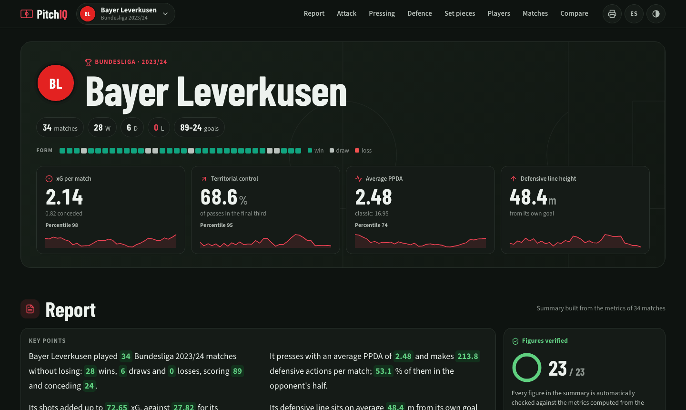
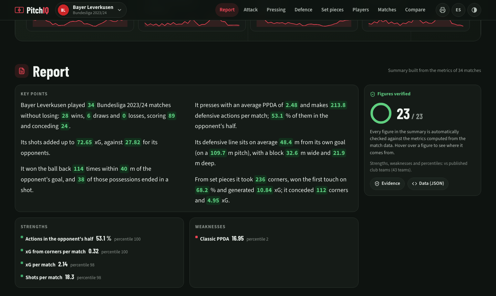
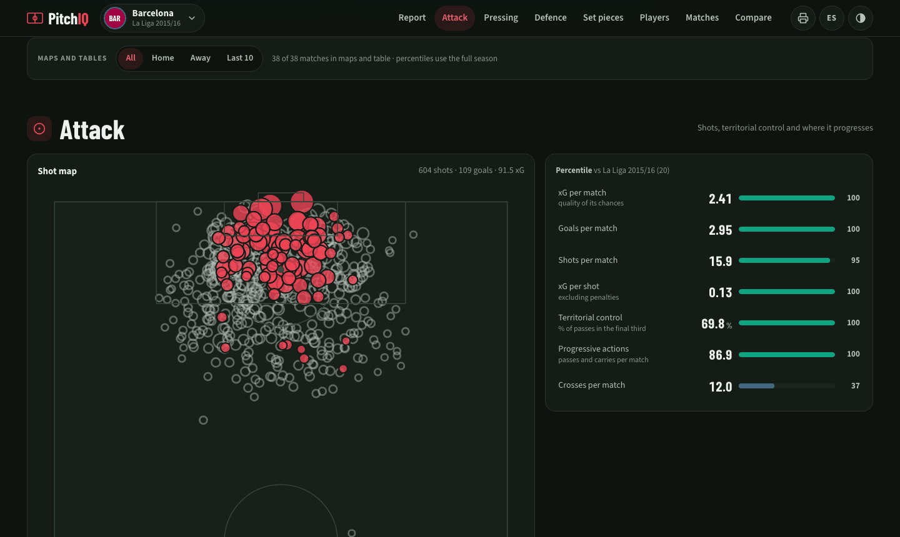
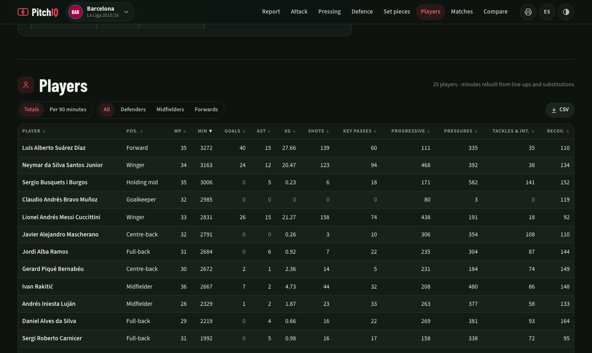
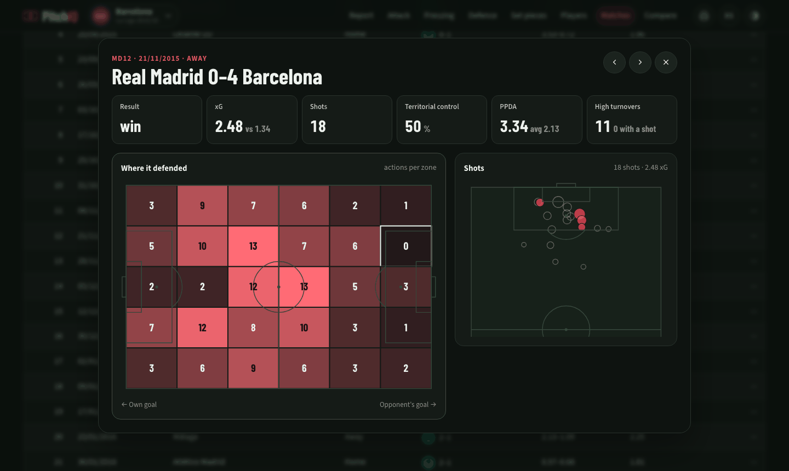
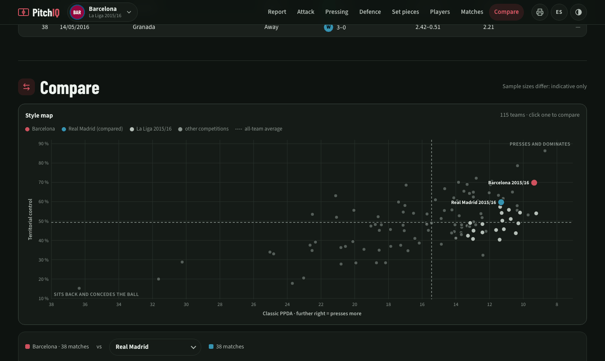

<div align="center">

# ⚽ PitchIQ

**Tactical scouting reports for 115 football teams — an LLM writes the prose, but it can't make up a single number: every figure is checked against metrics computed from StatsBomb event data.**

[](https://github.com/nicotimoneda/pitchiq/actions/workflows/ci.yml)


**English** · [Español](README.es.md)

</div>

---

<div align="center">

</div>

## What it does

An analyst preparing for the next opponent needs two things: the numbers, and someone to explain them. LLMs are good at the second and dangerous at the first — they write statistics that sound right and aren't. PitchIQ splits the job. Deterministic Python computes every metric from raw StatsBomb events (pressing, defensive shape from 360 freeze-frames, set pieces, attack, players, game state) for **115 teams**. The LLM only writes around those outputs, and a **grounding validator** checks every figure in the text against them: an unsupported number triggers a retry, and if it survives it is flagged in the report instead of published as fact.

Each metric also comes with context — a **percentile against the team's league or tournament** — so the page tells you what a team does well and badly, not just what it did.

## The app

A team page opens with its record, form and four key metrics with their percentile. Bayer Leverkusen 2023/24: 34 matches unbeaten, **2.14 xG per match (98th percentile)**:



The report: every number is highlighted and verified (23/23 here — hover one to see which metric backs it), followed by the team's **strengths and weaknesses**, computed automatically from the percentiles:



Attack: shot map sized by xG with goals on top, and each metric against the league. Barça 2015/16: 604 shots, 109 goals, first in La Liga for xG per match and for territory:



Players: minutes rebuilt from line-ups and substitutions, totals or per 90. Barça 2015/16 comes out as it happened — Suárez 40 league goals, Messi 26, Neymar 24 — straight from the events:



Every match has its own sheet and link (`#partido-12`) — Real Madrid 0–4 Barcelona, with xG, territory, PPDA, the defensive-action map and the shot map:



And a style map of all 115 teams (classic PPDA vs. territorial control); click any dot to compare head to head:



Also: splits by venue, half of the season, opponent strength and game state; a match filter; CSV export for matches and players; export to PDF; English and Spanish; light and dark themes; crests in club colours and flags for national teams.

## Results

Everything below is measured without an API key and reproducible from the repo ([full evaluation](EVALUATION.md), in Spanish).

| Check | Result |
|---|---|
| Grounding of the verified summaries | **100 %** of figures backed by a metric, 115 teams × 2 languages |
| Goals vs. [Understat](https://understat.com), match by match | **1,621 / 1,621** identical (43 clubs) |
| xG vs. Understat, match by match | correlation **0.93** (different models, same ranking of matches) |
| Classic PPDA vs. Understat, team ranking | Spearman **0.93** |
| The app's PPDA (counts pressures) vs. Understat | Spearman 0.74 — it measures pressing volume; documented, both are shown |
| Retrieval, English vs. multilingual embeddings | **80 % vs 60 %** top-1 — a "fix" of mine that was a regression, measured and reverted |

## Quick start

Requires [`uv`](https://github.com/astral-sh/uv).

```bash
git clone https://github.com/nicotimoneda/pitchiq.git
cd pitchiq
uv sync
uv run uvicorn app.main:app --port 8000     # → http://localhost:8000
```

The computed data for all 115 teams ships in the repo, so the app runs out of the box — no API key, no downloads.

```bash
uv run pytest                                                    # 94 unit tests (no network, LLM mocked)
uv run playwright install chromium && uv run pytest -m e2e       # 12 browser tests
uv run python scripts/precompute.py --demo-data --jobs 6         # recompute every team from StatsBomb (~20 min)
ANTHROPIC_API_KEY=sk-ant-... uv run python scripts/precompute.py # + the LLM-written report
```

## How it works

| Stage | Method | Detail |
|---|---|---|
| Data | StatsBomb Open Data | events + 360 freeze-frames, cached locally; teams chosen in [`publicacion.yaml`](scripts/publicacion.yaml) |
| Metrics | deterministic Python, all in metres | PPDA (two definitions), high turnovers, defensive block from 360, corners, shots and xG, territory, progressive actions, players, game state |
| Context | percentiles | against the league or tournament when it has ≥ 8 teams, otherwise against all published clubs or national teams |
| Report | LangGraph + Claude | tools → writer → grounding validator (1 retry with feedback, then flag) |
| Interpretation | RAG over a tactical glossary | Qdrant + MiniLM; the glossary **rejects any entry with digits**, so numbers only come from tools |
| Serving | FastAPI, precomputed | no API key and no ML libraries in production (CI checks the image); team data loaded on demand |
| Quality | pytest, Playwright, GitHub Actions | unit + browser tests, Docker build, weekly check for new StatsBomb seasons |

```
team ──▶ [deterministic tools] ──▶ [writer (LLM)] ──▶ grounding validator
                                     prose only        figure by figure
                                                            │ unsupported?
                                                            ▼
                                              1 retry with feedback ──▶ still there → flagged
```

## Stack

Python 3.11 · uv · statsbombpy · pandas / numpy / scipy · pydantic v2 · LangGraph · Anthropic (swappable `LLMClient`) · Qdrant · sentence-transformers · RAGAS · FastAPI · Playwright · pytest · ruff · Docker · GitHub Actions

## Project structure

```text
pitchiq/
├── src/pitchiq/
│   ├── data/            # StatsBomb loader with local cache
│   ├── metrics/         # pressing, 360 shape, set pieces, attack, players (pure functions)
│   ├── agent/           # LangGraph graph, tools, LLM client, grounding validator
│   ├── rag/             # tactical glossary (no digits), Qdrant retriever, RAGAS eval
│   └── eval/            # grounding, embeddings, generalisation, Understat comparison
├── app/                 # FastAPI + the web app (one template, no build step)
│   └── static/report/   # precomputed data for the 115 teams + share images
├── scripts/
│   ├── publicacion.yaml       # which teams are published
│   ├── precompute.py          # metrics (no key) and LLM report (key), --jobs for parallel
│   └── validacion_externa.py  # comparison against Understat
├── tests/               # unit tests + e2e/ (Playwright)
├── docs/metricas.md     # metric definitions and caveats (Spanish)
├── EVALUATION.md        # what the system claims, what it doesn't, and every limitation
└── .github/workflows/   # CI (tests, e2e, Docker) + weekly catalogue check
```

## Design notes

- **The LLM never computes.** Numbers come from tools; the model writes prose. The rule that verifies the LLM report is the same one that marks each figure in the web page.
- **Everything in metres.** StatsBomb works in yards on a normalised 120 × 80 pitch; values are converted at the source (and thresholds defined in metres), not relabelled.
- **Honest caveats in the product.** 360 freeze-frames only show the players on screen, so spatial metrics are approximations and are left empty rather than estimated when data is missing. xG is StatsBomb's model and is not mixed with other sources.
- **No logos.** Official crests are trademarks: clubs get their initials in club colours, national teams their flag.
- **Generate once, serve static.** The production app has no API key to leak and costs zero LLM calls per visit.

## Contact

Nicolás Timoneda · [nicotimoneda@gmail.com](mailto:nicotimoneda@gmail.com) · [@nicotimoneda](https://github.com/nicotimoneda)

## License

MIT — see [`LICENSE`](LICENSE). Data: [StatsBomb Open Data](https://github.com/statsbomb/open-data), used under its [terms](https://github.com/statsbomb/open-data/blob/master/LICENSE.pdf).
