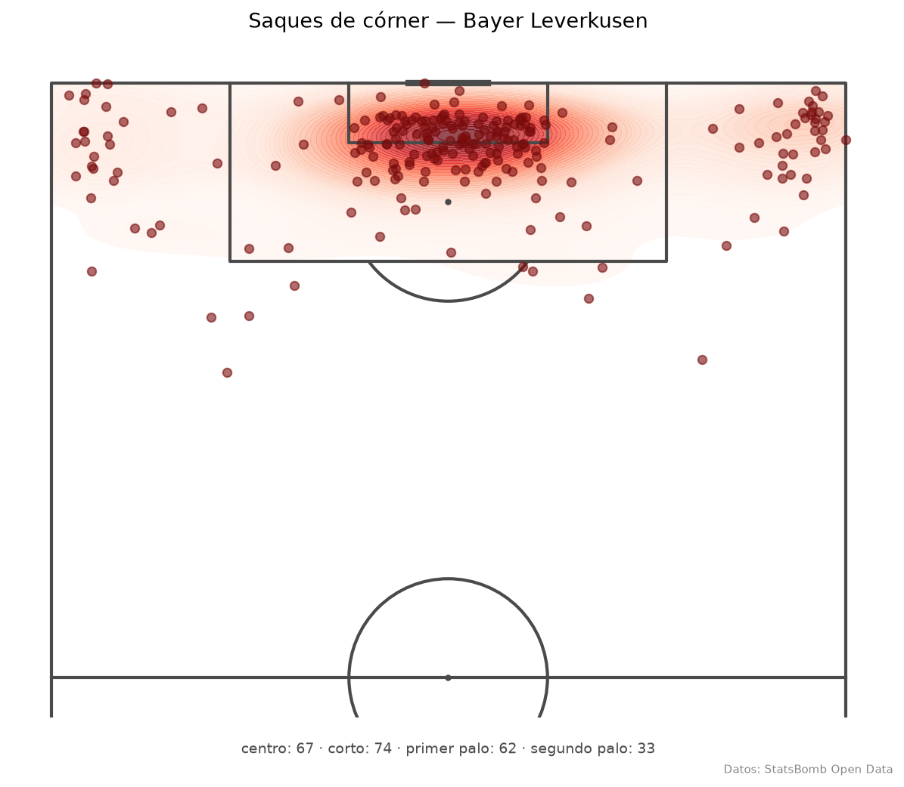
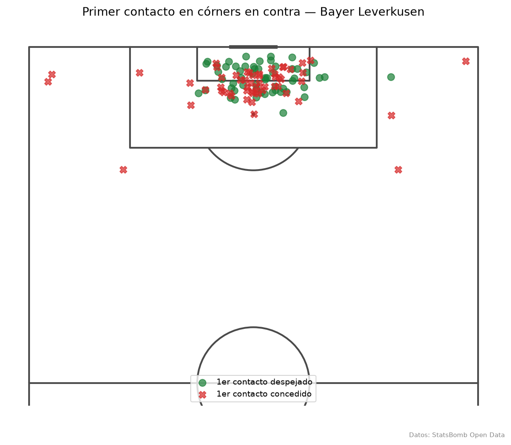
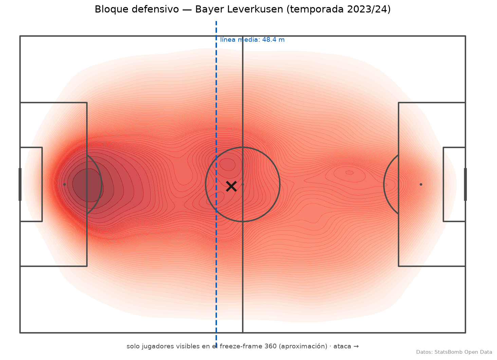
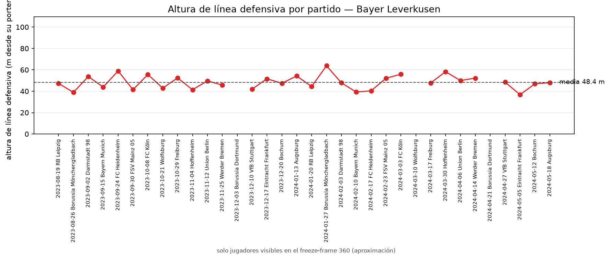

# Detalle de las métricas

## Las tres métricas espaciales (M2)

| Métrica | Qué mide | Sin datos suficientes |
|---|---|---|
| `defensive_compactness` | Dispersión del bloque de compañeros visibles en acciones defensivas: área del convex hull + anchura (rango y) × profundidad (rango x). Menos área = más compacto. | < 3 visibles → NaN (hull indefinido) |
| `defensive_line_height` | Media de x de los 4 compañeros visibles más retrasados (portero excluido) durante acciones defensivas. | < 4 visibles → NaN (no se estima una línea con menos jugadores de los que la definen) |
| `pressing_support` | Compañeros visibles a ≤ radio (por defecto 10 m) de la posición del evento Pressure (proxy del balón), sin contar al presionador. | Conteo mínimo: solo visibles |

> ⚠️ **Caveat crítico de los datos 360**: los freeze-frames solo capturan a los jugadores dentro del **área visible de la retransmisión**, no siempre los 22. Todas las métricas espaciales se computan sobre los jugadores **visibles** y son una **aproximación**: nunca se asumen 11 por frame, y cuando no hay suficientes visibles para definir una métrica, el valor es NaN — no se inventa. Además, 360 es freeze-frame (foto en el instante de cada evento), no tracking continuo.

> 📏 **Unidades: todo en metros.** StatsBomb da las coordenadas en yardas sobre un campo normalizado de 120 × 80. Todo lo publicado (salidas de herramientas que lee el LLM, web y verificador) se convierte a metros (109,7 × 73,2 m) y las áreas a m²; los umbrales se definen en metros (apoyo en la presión a 10 m, robo alto a 40 m).

## Córners (M3)

| Métrica | Qué mide | Lado |
|---|---|---|
| `delivery_zone` | Clasifica el saque por su destino: corto / primer palo / centro / segundo palo, relativo a la portería atacada (derivada del saque, sin orientación fija) | ataque |
| `box_load` | Atacantes y defensores **visibles** dentro del área grande al sacar + diferencial | ataque |
| `first_contact` | Equipo y localización del primer contacto tras el saque (ganado / perdido / concedido) | ambos |
| `corner_xg_for` / `corner_xg_against` | xG a favor / en contra en remates atribuidos a córner | ambos |
| `man_orientation_index` | **Proxy heurístico** de marcaje: distancia media de cada atacante rival visible a su defensor visible más cercano (portero excluido). Menor = más al hombre, mayor = más zonal | defensa |

Temporada 2023/24 del Leverkusen: 236 córners a favor (68 % de primer contacto ganado, 10,8 xG) y 112 en contra (50 % de primer contacto concedido, 5,0 xG en contra).

**Caveats de M3 — léelos antes de citar un número:**

1. **El índice de orientación al hombre es un proxy heurístico continuo**, no un clasificador de sistema de marcaje: mide proximidad media al marcador más cercano sobre jugadores visibles. Sirve para comparar tendencias entre partidos/equipos, no para afirmar "juega al hombre".
2. **Tamaño de muestra**: 236 córners a favor y 112 en contra en la temporada. Suficiente para patrones agregados (zonas de saque, % primer contacto); justa para subdivisiones finas (p. ej. "segundo palo con salida en corto en la segunda parte").
3. **Regla de atribución de xG a córner**: un remate cuenta como "de córner" si su `play_pattern == "From Corner"` (definición de StatsBomb, codificada en `CORNER_PLAY_PATTERN`). Remates en segundas jugadas largas pueden quedar fuera.
4. **Área visible de los 360** (caveat de arriba): `box_load` y el índice de orientación son cotas/aproximaciones sobre visibles; los córners sin freeze-frame quedan fuera de esas métricas (148/236 y 97/112 con 360 en la temporada).

Los huecos en la gráfica son partidos sin datos 360: se muestran como NaN, no se interpolan.

## Datos

67 equipos de [StatsBomb Open Data](https://github.com/statsbomb/open-data), definidos en [`scripts/publicacion.yaml`](../scripts/publicacion.yaml):

| Competición | Equipos | Datos de posiciones (360) |
|---|---|---|
| La Liga 2015/16 y Premier League 2015/16 | los 20 de cada liga, temporada completa | no |
| Bundesliga 2023/24 · La Liga 2020/21 · Ligue 1 2022/23 | Leverkusen, Barça y PSG (solo sus partidos) | sí |
| Eurocopa 2024 · Mundial 2022 | los 4 semifinalistas de cada torneo | sí |
| Eurocopa femenina 2025 | las 16 selecciones | sí |

Tres salvedades:

- En las temporadas parciales (Leverkusen, Barça 20/21, PSG) solo están **los partidos de ese equipo**, así que sus percentiles se calculan frente al resto de clubes publicados, no frente a su liga.
- Los semifinalistas del Mundial 2022 y de la Eurocopa 2024 son 4 por torneo, menos de 8: se comparan entre las **8 selecciones masculinas publicadas**. Las selecciones femeninas nunca se mezclan con las masculinas.
- Los datos 360 son **freeze-frames** del área visible (ver arriba), no tracking continuo.

Métricas de ataque, jugadores y estado del marcador: [`src/pitchiq/metrics/attack.py`](../src/pitchiq/metrics/attack.py) y [`players.py`](../src/pitchiq/metrics/players.py). Contraste con Understat: [EVALUATION.md](../EVALUATION.md#validación-externa-understat-1621-partidos-sin-key).
